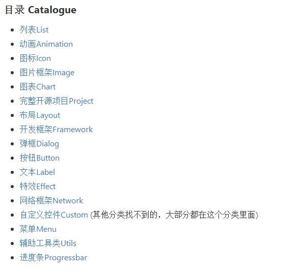

#· [ZQiang94/Andriod-collect-blogs](https://github.com/ZQiang94/Andriod-collect-blogs)  
大神记录的比较有价值的Android相关的blog  
***  

#· [litesuits/android-common](https://github.com/litesuits/android-common)  
Android开发的工具类  
***  

#· [GcsSloop/AndroidNote](https://github.com/GcsSloop/AndroidNote)  
Android的学习笔记，自定义View的内容比较丰富  

***  

#· [kakajika/RelativePopupWindow](https://github.com/kakajika/RelativePopupWindow)  
可以在指定控件周围弹出菜单窗口的lib，有时间要好好看看  
 
***   
 
#· [Trinea/android-open-project](https://github.com/Trinea/android-open-project)  
Android开源项目整理，报课开源项目源码解析等，查找资源的好地方。  

  
  

***  

#· [XXApple/AndroidLibs](https://github.com/XXApple/AndroidLibs)  
很齐全的各种开源lib，AndroidCat网站，也是查找资源的好地方 

***  

#· [LittleFriendsGroup/AndroidSdkSourceAnalysis](https://github.com/LittleFriendsGroup/AndroidSdkSourceAnalysis)  
Android SDK源码解析，看源码分析时可以来这里看看  

***  

#· [kesenhoo/android-training-course-in-chinese](https://github.com/kesenhoo/android-training-course-in-chinese)  
Android官方培训教程 中文版  

***  

#· [hehonghui/android-tech-frontier](https://github.com/hehonghui/android-tech-frontier/wiki)  
翻译国外优秀技术文章，列表在wiki查看  

***  

#. [litesuits / android-lite-orm]()  
阿里巴巴员工的开源库，分享的开源库里有orm的数据库框架，线程池管理的框架，以及异步任务框框和常用工具类框架等。

#. [JackyAndroid/AndroidInterview-Q-A](https://github.com/JackyAndroid/AndroidInterview-Q-A/blob/master/README-CN.md#%E6%8E%A5%E5%8F%A3%E7%9A%84%E6%84%8F%E4%B9%89-%E7%99%BE%E5%BA%A6)  
国内一线互联网公司内部面试题库  
 

